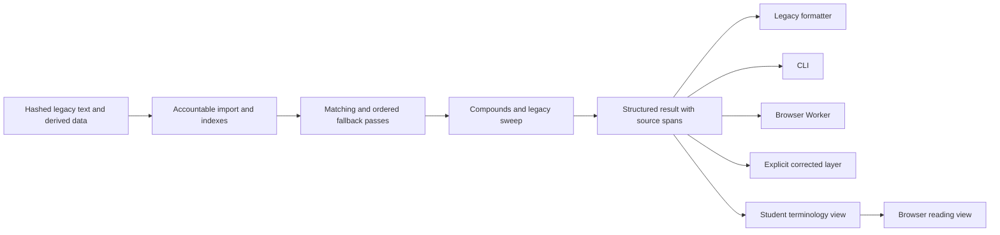

# Implementation architecture

The implementation ports the pinned Ada matching and control flow into small ESM
modules. It does not reuse another port's corrected dictionary or algorithms, and
does not answer words by looking up the compatibility corpus.

| Module | Responsibility |
|---|---|
| `src/data.ts` | Verify all six data hashes; parse rows and build stem/ending indexes |
| `src/core.ts` | Dictionary/inflection matching, uniques, prefixes, suffixes, tackons and PACK |
| `src/heuristics.ts`, `src/trick-tables.ts` | Ordered syncope, slury, orthographic and two-word passes |
| `src/numerals.ts`, `src/compounds.ts` | Original numeral rules and cross-token compound behavior |
| `src/sweep.ts`, `src/format.ts` | Native trimming, ordering, duplicate behavior and presentation |
| `src/english.ts` | English index search, native ranking, tie order and display |
| `src/index.ts`, `src/model.ts` | Source-loading API, typed morphology, spans and result identity |
| `src/reader.ts`, `src/terminology.ts` | Pure student view, contextual class names and shared abbreviation registry |
| `browser/render-reader.mjs` | DOM rendering of the reading view and terminology table |
| `node/`, `cli/`, `browser/` | File loading, command-line IO and same-origin Worker transport |

The core has no network, filesystem, terminal, database or ambient-configuration
dependency. Each analysis owns its pass state. Returned data is copied so callers
cannot change later results. The browser loads the same emitted modules and data.

## Portable derived tables

The native Ada dictionaries contain compiler/platform-specific records. They are
reference-build artifacts, not portable runtime input. Two complete portable
tables are exported by small Ada utilities calling the unmodified reference:

- `dictionary-forms.tsv`: **39,336** citation forms from
  `Support_Utils.Dictionary_Form`, covering every generated dictionary entry.
- `english-index.tsv`: **149,326** EWDS index records, including the initial null
  record, in exact native index order, with rank and source-entry identity.

These are whole-dataset build artifacts, not answers to selected input words.
The morphological matcher still works from the original four text files at
runtime. This choice retains legacy citation and English-index construction bugs
without making Ada a runtime dependency. `generate-data.py` verifies every original
source file before and after export. Both tables reproduced byte for byte from
two independently built reference directories; hashes and counts are in
`data/derived.lock.json`.

The original **39,335** dictionary rows yield **62,084** stem records, including
the compiler-added `sum` entry at ID 39,336. There are **1,797** inflection records,
**343** affix records and **79** unique records. Importers account for every active
row and preserve one-based source line numbers. Comments are not lexical records.

## Product boundaries

The browser page is a validation tool with a student reading view: input, compact
dictionary notation, expandable legacy output, inspectable JSON and cross-runtime
fixtures. The display layer consumes structured records, with no parsing of the
legacy terminal output. It uses the immutable design-system 2.3.0 web resource
subset recorded in `browser/design-system.lock.json`. It has no persistence,
telemetry, external fonts or complete dictionary UI. The server binds only to
loopback and serves an explicit set of product directories.

Future consumers should use the versioned WORDS contract, not treat its resolved
codes or glosses as the schema or linguistic authority of a new Latin analyzer.
